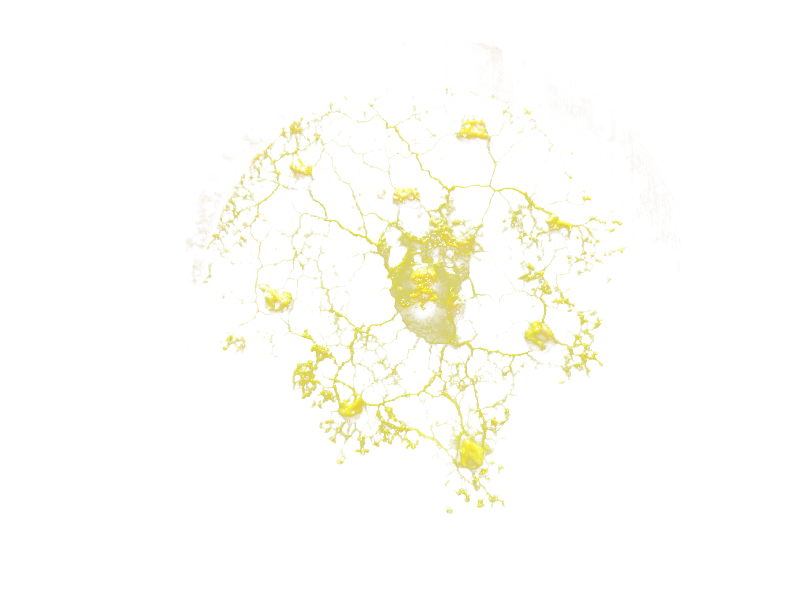

# slime machine 





This repository contains the AAARDM.py script, which is the philosophical artifact presented  in my [thesis](slime_machines.pdf). 

## Overview

AAARDM.py is a computer vision algorithm inspired by the behavior of slime moulds, particularly the species Physarum Polycephalum. The algorithm focuses on edge detection, starting from randomness and searching for solutions rather than predicting them. This approach provides both a philosophical and practical framework for a more ecological and inclusive form of computing.

## Features

- Utilizes the MEALPY library for the latest meta-heuristic algorithms in Python.
- Implements a modified version of the Slime Mould Algorithm (SMA).
- Generates truly random seeds using the Random.org JSON-RPC API.
- Includes caching for efficient objective function evaluations.

## Requirements

- Python 3.x
- Libraries: requests, numpy, matplotlib, scipy, pillow, functools, mealpy

## Installation

To install the required libraries, run:
```bash
pip install requests numpy matplotlib scipy pillow mealpy
```

## Usage

To use the script, follow these steps:

1. Download the repository: Clone the repository to your local machine using the following command:
   ```bash
   git clone https://github.com/yourusername/slime_machine.git
   ```
2. Navigate to the directory: Change into the repository directory:
    ```bash
   cd slime_machine
   ```
3. Replace "YOUR_API_KEY" with your API key from [random.org](https://api.random.org/api-keys)
   ```python
   api_key = 'YOUR_API_KEY'
   ```
4. Play with the parameters: You can adjust the epoch, pop_size, and p_t parameters in the model to see how they affect the results.
   ```python
   model = aaardm.DevSMA(epoch=30000, pop_size=200, p_t=0.05)
   ```

## Credits

The base of the code is credited to:

@article{van2023mealpy,
   title={MEALPY: An open-source library for latest meta-heuristic algorithms in Python},
   author={Van Thieu, Nguyen and Mirjalili, Seyedali},
   journal={Journal of Systems Architecture},
   year={2023},
   publisher={Elsevier},
   doi={10.1016/j.sysarc.2023.102871}
}

@article{van2023groundwater,
   title={Groundwater level modeling using Augmented Artificial Ecosystem Optimization},
   author={Van Thieu, Nguyen and Barma, Surajit Deb and Van Lam, To and Kisi, Ozgur and Mahesha, Amai},
   journal={Journal of Hydrology},
   volume={617},
   pages={129034},
   year={2023},
   publisher={Elsevier},
   doi={10.1016/j.jhydrol.2022.129034}
}

## License

This project is licensed under the Creative Commons Attribution-NonCommercial-ShareAlike 4.0 International License. To view a copy of this license, visit [https://creativecommons.org/licenses/by-nc-sa/4.0/](https://creativecommons.org/licenses/by-nc-sa/4.0/).
